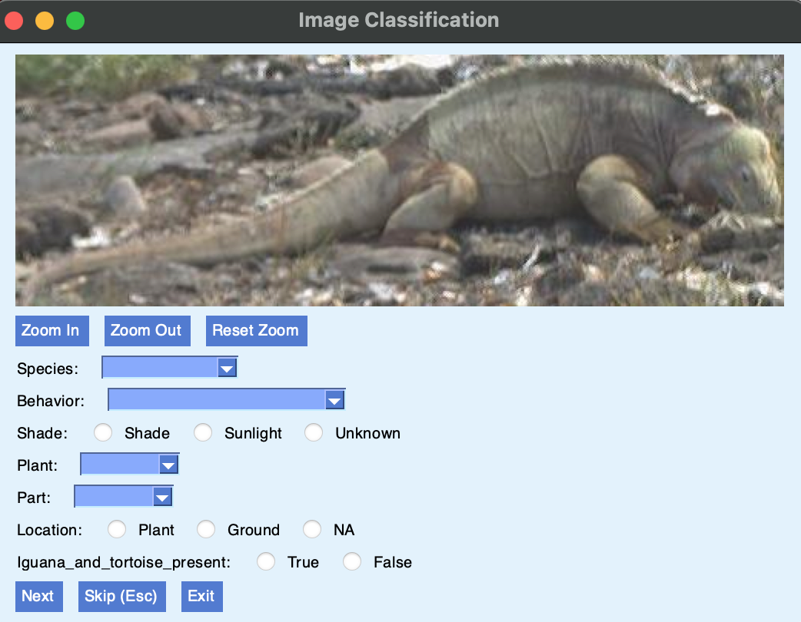
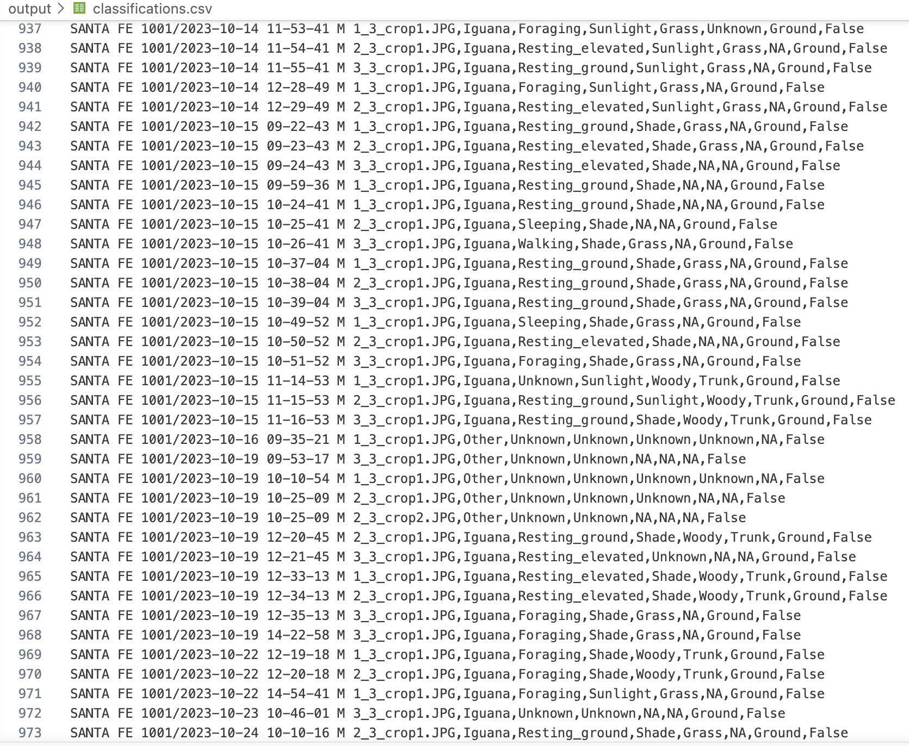
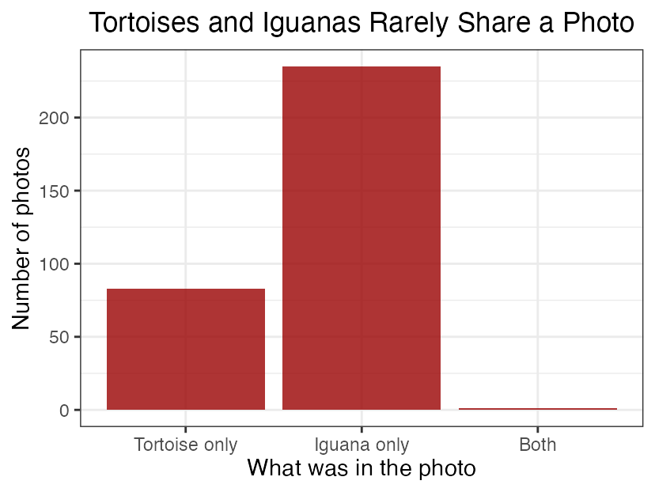
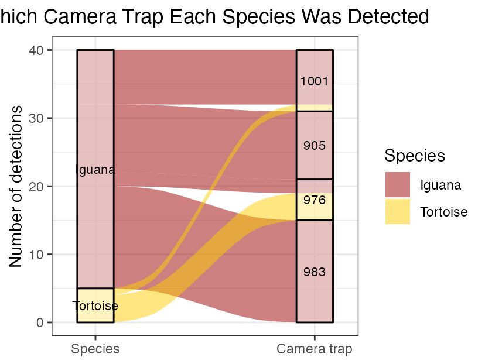
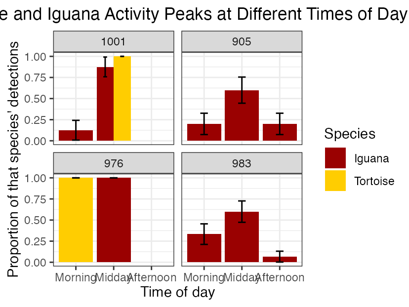
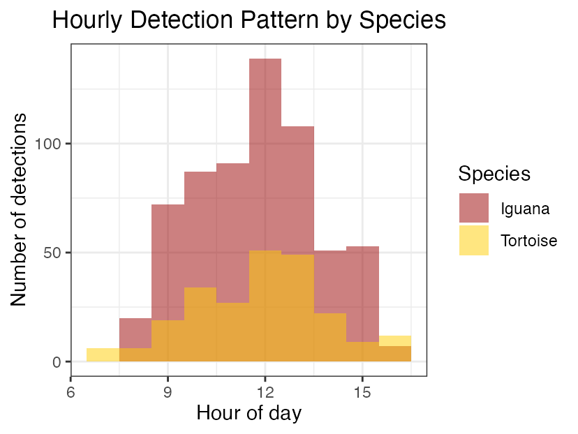

# Arielle's Camera Trap Workflow
## A Guide To Classifying Camera Trap Images

## Project Overview
This project investigates whether Galápagos tortoises and iguanas share overlapping habitat on Santa Fé Island, or actively avoid direct competition with one another. Using five Reconyx Hyperfire 2 camera traps placed across the island from July 2023 to May 2025, I classified hundreds of camera trap images to examine when and where each species was detected. Raw images were processed using an automated detection model (MegaDetector) to identify which images contained animals, and were then manually classified using a custom Python-based tool built by my mentor, Charles Lehnen. My findings suggest that while tortoises and iguanas were rarely photographed together and tended to favor different camera trap sites, both species were active during similar times of day, pointing to spatial rather than temporal avoidance between the two species. This site walks through the full technical process behind my analysis, from setting up the environment to building the final figures.

## Background

Santa Fé Island is a small, remote island in the Galápagos Archipelago of Ecuador.

- The Galápagos Islands are home to the endemic Galápagos iguana and Galápagos tortoise.
- The Santa Fé tortoise species went extinct in the mid-1800s, largely due to hunting by sailors and whalers passing through the islands at the time. Because no genetic sample of the original species survived, a closely related tortoise species was introduced to the island starting in 2015 to help restore its ecological balance.
- The Galápagos land iguana, meanwhile, remained on the island throughout this time and was never displaced.
- Because these species share the same environment, there may be spatial overlap or active avoidance between them.


## Tools Used
- Positron (IDE)
- Python 3.11
- GitHub / GitHub Desktop
- MegaDetector (AI detection model)
- R (for data analysis and figures)
- Markdown

## Learning GitHub and Markdown

Before starting the actual research project, my mentor introduced me to GitHub and Markdown on my first day. GitHub is a platform used to store code and track changes on a project over time, and Markdown is a simple formatting language used to write styled text that is then converted into HTML. To practice, I created a test README file written in Markdown which was themed around SpongeBob just to get comfortable with the syntax before using it on anything that mattered for my actual research. I used a cheat sheet located on Charles Lehnen's website.
This first day is also where I learned the core Git vocabulary I'd use throughout the rest of the project:

- **Commit** – saving your changes, along with a short message describing what you changed
- **Push** – sending your committed changes up to GitHub, so they're saved online 
- **Pull** – downloading any new changes from GitHub down to your own computer
- **Fetch** – checking GitHub for new changes 
Learning these basics early made the rest of the project much smoother, since I already understood how to save and track my work before I started making classifications.


## Step 1: Setting Up the Environment
I had to download an IDE (Integrated Development Environment) to write and run my code, so I used Positron. IDEs are what coders use to write, test, and debug code. Other IDEs include RStudio, which is built specifically to run R code. Positron, on the other hand, was built to support both R and Python from the ground up, and since it's a fork of VS Code, it can be made to run many other languages too.

- In order to run the classification GUI tool Charles built, I needed Python installed on my computer. Since my MacBook is from early 2015, I had to install an older, compatible version of Python using my Mac terminal.
- I also had to set up a virtual environment (venv). A venv is like a boxed-up workspace that only contains a specific Python version and its dependencies, kept separate from anything else installed on the computer. I created mine using the terminal:

```bash
python3.11 -m venv venv
source venv/bin/activate
```

After that, I installed all the required dependencies (external code libraries the project needed) so Python could actually run the tool:

```bash
pip install -r requirements.txt
```

## Step 2: Running Unsupervised Detection
- MegaDetector is an open-source AI tool used to detect animals, humans, and vehicles in camera trap images. It scans through thousands of photos and filters out the blank ones automatically. MegaDetector assigns a confidence score to each detection, and the user chooses how confident the AI needs to be before counting something as a real detection. In my case, I was looking specifically for animals.
- Running ‘capture_images.py’ starts this process automatically across all your images:

```bash
python3 code/capture_images.py
```

- This produces outputs: bounding box images, cropped images (close ups of just the animals), and a ‘metadata.csv’ file summarizing details like date, time, and camera location for each detection.

## Step 3: Manual Classification
A GUI (Graphical User Interface) is a visual way to interact with a program. Instead of writing code, you click or tap buttons. The image classification tool I used was built by Charles Lehnen: [view his repository here](https://github.com/CharlesLehnen/camera_trap_analysis).

The fields I classified for each image were: Species, Behavior, Shade, Plant, Part, Location, and Iguana_and_tortoise_present (True/False). 



The GUI lets you classify using either keyboard shortcuts (faster, once you know the categories) or dropdown/radio buttons (slower, but more visual).

```bash
python3 code/image_classification.py
```

## Step 4: Extracting Site and Time-of-Day Data
Rather than manually recording which camera took each photo or what time of day it was taken, this information was pulled directly from each image's existing metadata. 

## Step 5: Analyzing the Data in R
I used R to read in my finished 'classifications.csv' file and calculate the patterns behind my results: how often each species appeared together, how their detections were distributed across camera sites, and how their activity compared across different times of day. Using the `ggplot2` package, four main figures were built from this data:

- A bar chart showing how rarely tortoises and iguanas were photographed together
- A chart comparing where each species was detected across camera sites
- A chart comparing each species' activity levels across different times of day
- A heatmap showing which species was detected more often at each camera site during each time of day
- 

## Building the Figures: species_interactions.qmd

All of my data analysis and figure building was done in a separate Quarto file called 'species_interactions.qmd', using R. This file reads in my finished 'classifications.csv', processes it, and generates each of the plots used in my results.

Here are the figures built, along with the code used to generate each one:

### Co-occurrence Bar Chart

```r
dfphoto_focal %>%
  ggplot(aes(x = composition)) +
  geom_bar(fill = "#9a0101", alpha = 0.8) +
  labs(title = "Tortoises and Iguanas Rarely Share a Photo",
       x = "What was in the photo", y = "Number of photos") +
  theme_bw() +
  theme(plot.title = element_text(hjust = 0.5))

ggsave(filename = "../output/r_analysis/CoOccurrenceBarPlot.png", width = 10, height = 8, dpi = 300)
```

{width=30% fig-align="center"}

### Species by Camera Trap (Alluvial Chart)

```r
dffocal_loc %>%
  count(species, camera_trap_name, name = "frequency") %>%
  ggplot(aes(y = frequency, axis1 = species, axis2 = camera_trap_name)) +
  geom_alluvium(aes(fill = species), width = 1/6) +
  geom_stratum(alpha = 0.5, width = 1/6) +
  geom_text(stat = "stratum", size = 3, aes(label = after_stat(stratum))) +
  scale_fill_manual(values = c(
    "#9c0100",
    "#ffcd01"
  )) +
  scale_x_discrete(limits = c("Species", "Camera trap"), expand = c(0.1, 0.1)) +
  labs(title = "Which Camera Trap Each Species Was Detected",
       y = "Number of detections", fill = "Species") +
  theme_bw() +
  theme(plot.title = element_text(hjust = 0.5))

ggsave(filename = "../output/r_analysis/SpeciesByCameraAlluvialPlot.png", width = 10, height = 8, dpi = 300)
```

{width=30% fig-align="center"}

### Activity by Time of Day, by Camera

```r
dffocal_loc %>%
  count(camera_trap_name, time_of_day, species) %>%
  group_by(camera_trap_name, species) %>%
  mutate(
    total      = sum(n),
    proportion = n / total,
    se         = sqrt(proportion * (1 - proportion) / total)
  ) %>%
  ungroup() %>%
  ggplot(aes(x = time_of_day, y = proportion, fill = species)) +
  geom_col(position = position_dodge(width = 0.9)) +
  geom_errorbar(aes(ymin = pmax(proportion - se, 0), ymax = proportion + se),
                position = position_dodge(width = 0.9), width = 0.2) +
  scale_fill_manual(values = c("#9a0101", "#ffcd01")) +
  labs(title = "Tortoise and Iguana Activity Peaks at Different Times of Day",
       x = "Time of day", y = "Proportion of that species' detections",
       fill = "Species") +
  theme_bw() +
  theme(plot.title = element_text(hjust = 0.5)) +
  facet_wrap(~camera_trap_name)

ggsave(filename = "../output/r_analysis/TimeOfDayByCameraPlot.png", width = 19, height = 8, dpi = 300)
```

{width=30% fig-align="center"}

### Hourly Detection Pattern

```r
dffocal %>%
  ggplot(aes(x = hour, fill = species)) +
  geom_histogram(binwidth = 1, position = "identity", alpha = 0.5) +
  labs(title = "Hourly Detection Pattern by Species",
       x = "Hour of day", y = "Number of detections", fill = "Species") +
  scale_fill_manual(values = c("#9a0101", "#ffcd01")) +
  theme_bw() +
  theme(plot.title = element_text(hjust = 0.5))

ggsave(filename = "../output/r_analysis/HourlyActivityPlot.png", width = 10, height = 8, dpi = 300)
```

{width=30% fig-align="center"}


## Results Summary
Out of the images I classified, tortoises and iguanas were rarely photographed together, appearing in the same frame in less than 1% of images. Both species were active during similar times of day, with detections peaking around midday for each, yet they tended to favor different camera trap sites overall. Together, these results suggest the two species may coexist by avoiding direct contact at a spatial scale, rather than by separating according to time of day. For my full research poster and discussion of these findings, [see here](https://postimg.cc/fkHGkFGB).

## Discussion

Tortoises and iguanas were rarely photographed together, appearing in the same frame in less than 1% of classified images.

- This suggests direct co-occurrence was uncommon even though both species occupied the same general habitat.
- Both species were detected at several of the same camera trap locations (like 976 and 983), indicating a partial overlap rather than a complete separation of habitat use. However, species did favor different camera trap sites. This outcome indicates I should reject my "Overlap hypothesis" because species displayed spatial overlap with interspecies avoidance.
- Although tortoises and iguanas were rarely photographed together, they were active during similar times of the day. Following our analysis this is because they were present at different camera trap sites during differing time periods.
- This suggests the two species are not avoiding each other by being active in the habitat overall at different times, so my "Avoidance hypothesis" is not supported. However, the data suggests they are avoiding one another at the site level.

## Reflections
Overall, having the opportunity to work one on one with someone who's an expert in this field has been an amazing experience. Although I'm not necessarily interested in biological sciences, I am interested in computer science, so this project gave me hands-on skills I can directly apply to future computer science work. 
Beyond the bigger technical skills, I picked up a lot of small, practical tricks along the way that made me faster and more comfortable working in the terminal. Using the up arrow to re-run a command I'd already typed instead of retyping it saved some time. I also learned the importance of committing my changes regularly as I worked, so that my progress was always saved and recoverable.
I also learned firsthand how research doesn't always go the way you expect. My original hypotheses predicted either full habitat overlap or a clear pattern of time-based avoidance between species, but my actual data showed something more nuanced than either option, which pushed me to think more carefully about what my results really meant instead of forcing them into a simple yes or no conclusion. 
